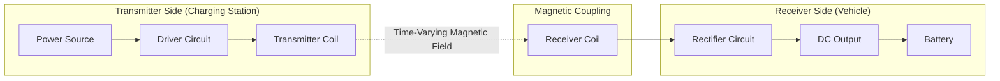

# 🗺️ Block Diagram: Wireless EV Charging System

This document describes the block-level architecture of the Wireless EV Charging System, showing signal/power flow from the transmitter (charging station) side to the receiver (vehicle) side.

---

## 1. 🔌 High-Level Block Diagram

---

## 2. 🧩 Block Descriptions

| Block | Side | Function |
|---|---|---|
| Power Source | Transmitter | Supplies input electrical energy to the system |
| Driver Circuit | Transmitter | Excites the transmitter coil with alternating current |
| Transmitter Coil | Transmitter | Generates a time-varying magnetic field |
| Magnetic Coupling | — | Links transmitter and receiver coils via the magnetic field (no physical connection) |
| Receiver Coil | Receiver | Captures the magnetic field and induces an AC voltage |
| Rectifier Circuit | Receiver | Converts the induced AC voltage into DC |
| DC Output | Receiver | Stable DC power delivered for charging |
| Battery | Receiver | Vehicle battery being charged |

---

## 3. ➡️ Signal Flow Summary

1. **Power Source → Driver Circuit:** Input electrical energy is supplied to the driver circuit
2. **Driver Circuit → Transmitter Coil:** Driver circuit excites the coil with alternating current
3. **Transmitter Coil → Receiver Coil:** Energy is transferred wirelessly through the generated magnetic field (electromagnetic induction)
4. **Receiver Coil → Rectifier Circuit:** Induced AC voltage is passed to the rectifier
5. **Rectifier Circuit → Battery:** Converted DC output is delivered to the battery for charging

---

## 4. 📝 Notes on Diagram Rendering

This diagram uses [Mermaid syntax](https://mermaid.js.org/), which renders automatically as a visual flowchart when viewed on GitHub (in README files, issues, and markdown previews). No external image file or tool is required — the diagram is defined entirely in text form within this markdown file.
